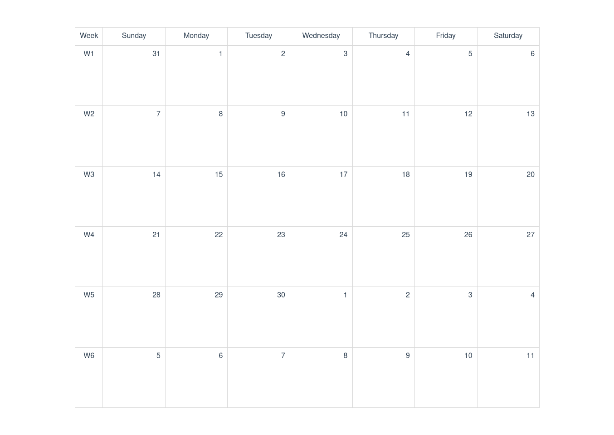

# Tedir Calendar
Tedir Calendar is a Vue 3 & Web Component for Date Picker, Time Picker and Event Calendar

```shell
npm install tedir-calendar --save-dev

#or

yarn add tedir-calendar -d
```

#### Demo

